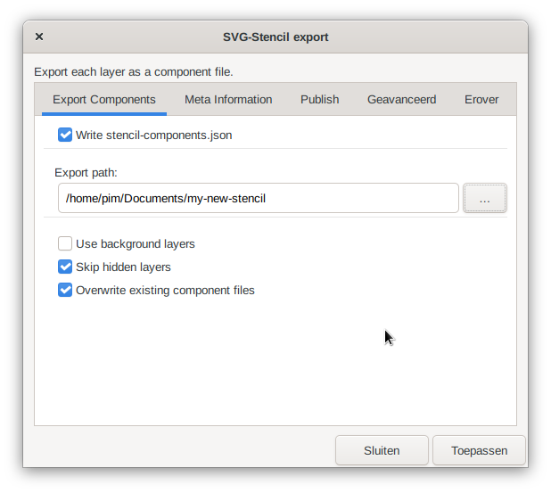
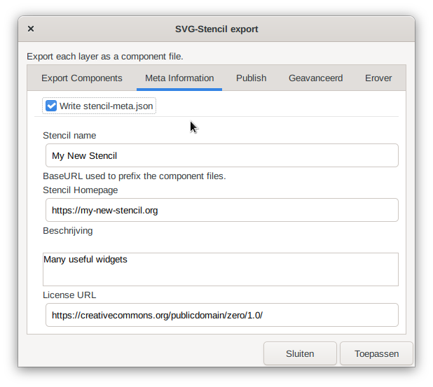
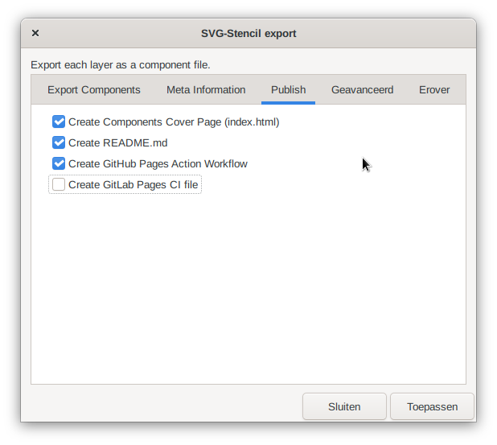

# Inkscape SVG Stencil Export Extension


This extension helps creating new stencils for [svg-stencils.github.io](https://svg-stencils.github.io/).

## Features

- Exports each layer as component svg-file
- Choose which layers to export.
- Automated file naming.
- Optionally creates a stencil-meta.json
- Optionally creates a front page index.html
- Optionally creates a README.md
- Optionally creates a Github Pages Action configuration file
- Optionally creates a Gitlab Pages CI configuration file

# Install
Download this project and copy the extension files (`svg_stencil_export.inx` and `svg_stencil_export.py`) to the config path of your Inkscape installation.

One simple way of finding the config path is to open Inkscape and go to **Edit
> Preferences > System**. The path will be listed in the **User extensions**
field. Make sure you restart Inkscape after you copied the extension files at
the desired location and the extension will be available in the extensions
menu.

### Linux
The default path on Linux is:
```
~/.config/inkscape/extensions
```

If you installed the flatpak version:
```
~/.var/app/org.inkscape.Inkscape/config/inkscape/extensions
```

### Windows
The path on Windows 10 is this:
```
C:\Users\[yourWindowsusername]\AppData\Roaming\inkscape\extensions
```
If you don't see the AppData folder, you need to set the windows explorer to show hidden files.

# Usage

After the extension is installed, it can be found in the **Extensions** menu, **Export** submenu.

## Steps for a new stencil published on GitHub

- Create a new git repo on github and clone this repo on your computer.
- Open Inkscape.
- Place all the components of your stencil on a separate layer.
- Open the SVG Stencil Export Extension from the **Extension** menu
- Select the cloned repository folder and make sure the rest of the **Export components** tab looks like this.



- Make sure the **Meta information** tab looks like this:



- Make sure the **Publish** tab looks like this:



- Click apply
- Add, commit and push all new files in the git repo
- On Github configure the repo to use the gh-pages branch for github pages.

# License

This project is licensed under the
[MIT](https://raw.githubusercontent.com/svg-stencils/inkscape-svg_stencil_export/main/LICENSE)
license.

## Credits

This extensions was based on [svg_stencil Export](https://github.com/StefanTraistaru/batch-export)
